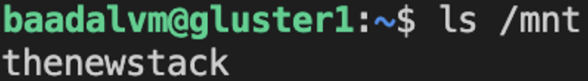

# cloud-project
Benchmarking of HDFS vs Gluster FS

## Setting Up Gluster-FS
We use 3 `baadalvm` machines (2 Servers and 1 Client) for this project

#### Update and Upgrade
Make sure to first update and upgrade all the machines. 
```
sudo apt-get update
sudo apt-get upgrade
```
#### Naming the Machines
We name the machines `gluster1`, `gluster2` and `gluster3`
```
sudo hostnamectl set-hostname gluster1
```
```
sudo hostnamectl set-hostname gluster2
```
```
sudo hostnamectl set-hostname gluster3
```
#### Add Hosts
We need to map the addresses in the `/etc/hosts` file. Open the file with the following command
```
sudo nano /etc/hosts
```
Add the following lines to the end of the file on each of the machines.
```
<IP of Server1> gluster1
<IP of Server2> gluster2
<IP of Client> gluster3
```

### Server Setup
We need to first install `glusterfs-server` on both the Servers. This can be done with the command:
```
sudo apt-get install glusterfs-server -y
```
After the installation completes, start and enable GlusterFS on each server
```
sudo systemctl start glusterd
sudo systemctl enable glusterd
```

#### Configuring the Cluster
Create a trusted pool on `gluster1` with the command:
```
sudo gluster peer probe gluster2
```
Verify the status of the cluster with the command:
```
sudo gluster peer status
```
The output should be something like
Insert Photo

#### Creating a Distributed Volume
Create a new directory on both `gluster1` and `gluster2` for GlusterFS
```
sudo mkdir -p /glusterfs/distributed
```
We now create the volume `v01` that will replicate on both `gluster1` and `gluster2`
```
sudo gluster volume create v01 replica 2 transport tcp gluster1:/glusterfs/distributed gluster2:/glusterfs/distributed
```
Once the creation of the volume succeeds, start the volume with the command:
```
sudo gluster volume start v01
```
The creation of the volume can be verified as
```
sudo gluster volume info v01
```

### Setting Up the Client
We need to install `glusterfs-client` on the Client (`gluster3`)
```
sudo apt install glusterfs-client -y
```
Create a new directory on `gluster3`
```
sudo mkdir -p /mnt/glusterfs
```
We now mount the distributed file system with the command
```
sudo mount -t glusterfs gluster1:/v01 /mnt/glusterfs/
```
#### Mount File System at Boot (Optional)
If you want that the distributed file system is mounted at boot then the `fstab` file needs to be edited. Open the file with the command:
```
sudo nano /etc/fstab
```
Add the following line to the bottom of the file
```
gluster1:/v01 /mnt/glusterfs glusterfs defaults,_netdev 0 0
```

### Testing the Filesystem
With the setup completed we now have to ensure that our file system is functioning as expected.
On `gluster1` issue the command
```
sudo mount -t glusterfs gluster1:/v01 /mnt
```
On `gluster2` issue the command
```
sudo mount -t glusterfs gluster2:/v01 /mnt
```
Create a new file in `gluster3` using the command:
```
sudo touch /mnt/glusterfs/thenewstack
```
Check that the new file appears on both `gluster1` and `gluster2` using
```
ls /mnt
```
You should see the file on both `gluster1` and `gluster2`


### Benchmarking
We use [fio](https://github.com/axboe/fio) to do the benchmarking

#### Setting up fio
On the Client `gluster3` run the following commands:
```
git clone https://github.com/axboe/fio.git
cd fio
./configure
make
sudo make install
```

The tests we have used are given below
#### Random Write Test
```
fio --name=random_write_test \
    --rw=randwrite \
    --bs=4k \
    --size=1G \
    --numjobs=4 \
    --iodepth=128 \
    --runtime=60 \
    --direct=1 \
    --group_reporting \
    --filename=/dev/your_device
```

#### Random Read Test
```
fio --name=random_read_test \
    --rw=randread \
    --bs=4k \
    --size=1G \
    --numjobs=4 \
    --iodepth=128 \
    --runtime=60 \
    --direct=1 \
    --group_reporting \
    --filename=hdfs://namenode:9000/testdata/localfile.txt
```

#### Sequential Read Test
```
fio --name=sequential_read_test \
    --rw=read \
    --bs=4k \
    --size=1G \
    --numjobs=4 \
    --iodepth=32 \
    --runtime=60 \
    --direct=1 \
    --group_reporting \
    --filename=hdfs://namenode:9000/testdata/localfile.txt
```    

#### Sequential Write Test
```
fio --name=sequential_write_test \
    --rw=write \
    --bs=4k \
    --size=1G \
    --numjobs=4 \
    --iodepth=32 \
    --runtime=60 \
    --direct=1 \
    --group_reporting \
    --filename=hdfs://namenode:9000/testdata/localfile.txt
```